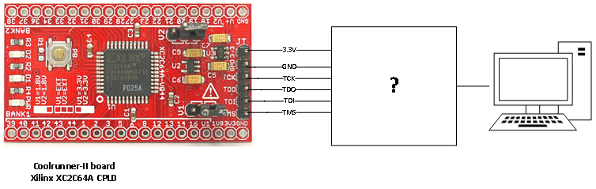
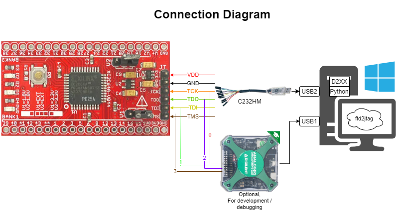

# JTAG Interview Question

This is a small software application written in Python that interacts with a
Xilinx XC2C64A chip mounted on a CoolRunner-II development board.

This design fills in the "back box" between the PC and the JTAG interface on the
chip.



The program:

1. Reads back the unique IDCODE from the XC2C64A chip, and compares it to the IDCODE in the chip’s datasheet.
2. Blinks D1 and D2 (alternating) at 0.5Hz

The module written can be extended to implement JTAG control over other chips.

## Equipment

The equipment needed to complete this exercise includes:

* [CoolRunner-II Development Board](img/coolrunner_II_dev_board.jpg)

* [FTDI C232HM-DDHSL-0 USB Dongle](img\C232HM.webp)

* [Analog Discovery 2](img\analog_discovery_2.jpg) (optional, for development/debugging)

* [Breadboard](img\breadboard.jpg) (optional, for development/debugging)

* Python >3.6

## Installation

Wire up the project according to the connection diagram:


This code is tested to run on Windows 10 in Powershell

I recommend creating a virtual environment before running, but this is optional:

```powershell
PS path\to\ftd2jtag> py -m venv env
PS path\to\ftd2jtag> .\env\Scripts\activate
```

```powershell
PS path\to\ftd2jtag> pip install -r requirements.txt
```

## Usage

```powershell
PS path\to\ftd2jtag> py .\jtag_exercise.py
```

You may also view the JTAG signals in the [WaveForms project](tests/waveforms/jtag.dwf3logic) using
the Analog Discovery 2.

## Resources

Finding the right datasheets, schematics, and other files from the
manufacturer websites was crucial to completing the exercise.

### Equipment Datasheets

* [CoolRunner-II CPLD breakout board hardware overview](http://dangerousprototypes.com/docs/CoolRunner-II_CPLD_breakout_board)
  * [Xilinx XC2C64A CoolRunner-II CPLD Datasheet](https://www.xilinx.com/support/documentation/data_sheets/ds311.pdf)
* [FTDI C232HM-DDHSL-0 USB Dongle Datasheet](https://www.ftdichip.com/Support/Documents/DataSheets/Cables/DS_C232HM_MPSSE_CABLE.pdf)
  * [FTDI FT232H Datasheet](https://www.ftdichip.com/Support/Documents/DataSheets/ICs/DS_FT232H.pdf)

### JTAG Programming Resources

* [FTDI Application Note AN_135 FTDI MPSSE Basics](https://www.ftdichip.com/Support/Documents/AppNotes/AN_135_MPSSE_Basics.pdf)
* [FTDI D2XX Programmer's Guide](https://www.ftdichip.com/Support/Documents/ProgramGuides/D2XX_Programmer's_Guide(FT_000071).pdf)
* [FTDI Application Note AN_108 Command Processor for MPSSE...](https://www.ftdichip.com/Support/Documents/AppNotes/AN_108_Command_Processor_for_MPSSE_and_MCU_Host_Bus_Emulation_Modes.pdf)
* [FTDI Application Note AN_129 Interfacing FTDI USB Hi-Speed Devices to a JTAG TAP](https://www.ftdichip.com/Support/Documents/AppNotes/AN_129_FTDI_Hi_Speed_USB_To_JTAG_Example.pdf)
* [CoolRunner-II BSDL files](https://www.xilinx.com/support/download/index.html/content/xilinx/en/downloadNav/device-models/bsdl-models/cplds.html)
* [CoolRunner-II Programmer Qualification Specification](https://ia801201.us.archive.org/0/items/CoolRunnerIIProgrammerQualificationSpecification/CoolRunner-II%20Programmer%20Qualification%20Specification.pdf)

## Dependencies

[Python >3.6](https://www.python.org/downloads/)

[ftd2xx](https://pypi.org/project/ftd2xx/)

[bsdl-parser](https://pypi.org/project/bsdl-parser/)
