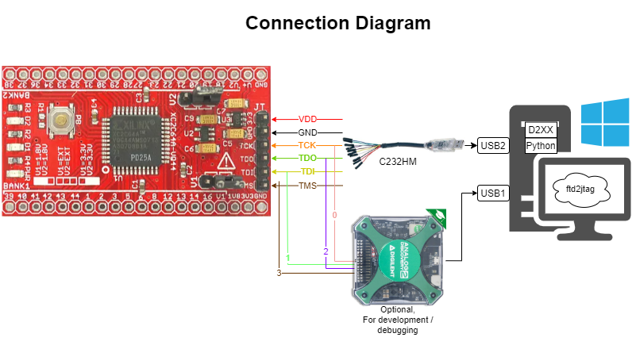

# Additional Questions (and Answers)

1. What is the architecture of your implementation? Show a detailed schematic and connection diagram.
    * Schematic:
      
    * Connection Diagram:
      

2. Describe the operation of your solution in detail. Were there any designs that you tried but didn’t use?
    * My solution utilizes the Python [`ftd2xx`](https://github.com/cyrozap/python-bsdl-parser) library to communicate with the
      FT232H chip inside the C232HM-DDHSL-0 cable. It uses the Multi-Protocol
      Synchronous Serial (MPSSE) engine of
      the chip to bitbang the JTAG signals for reading the IDCODE using the
      IDCODE instruction. It then uses the EXTEST (boundary scan) instruction to
      blink the LEDs. To get the right information required for JTAG operation,
      the program reads the bsdl file for the XC2C64a chip into JSON using the
      [`bsdl-parser`](https://github.com/cyrozap/python-bsdl-parser) library.

    * I also tried using the Python `pyftdi` library, but although it has many
      more useful features than `ftd2xx`, including some JTAG capabilities, it
      required the use of a different driver than what is automatically
      installed on a Windows machine. Thus, the user would have to use another utility to swap the
      driver themselves. I chose to go with `ftd2xx` due to its
      simplicity as well as its ability to plug-and-play. One downside to this
      choice is that `ftd2xx` is no longer actively maintained, however I feel
      like I can probably be a maintainer after spending a decent amount of time
      with it!

    * I played around with the "Synchronous Bit Bang" mode of the FT232H chip,
      but decided to go with the MPSSE to bitbang the signals as this type of thing is really
      what its meant for and there was some good documentation for getting started.

3. What language did you choose for the software implementation? What pros/cons went into your decision?
    * There were two languages that seemed to be the best suited for the task at
      hand; Python and C++. The D2XX library provided by FTDI for communicating with the
      FT232H came with a header file and example code in C++ (needed to download
      from the website, though). However, I had
      some issues getting it to compile due to linker errors, and when I was
      eventually able to compile and run, it seemed like there was a lot of code
      and ways to make mistakes.

    * I instead went with Python, because there was a
      couple of helpful libraries, a D2XX wrapper and a BSDL parser, that came
      in handy. I found it much easier to develop in Python, which is usually
      true of most small programs where efficiency is not of the utmost
      importance. Another helpful part about developing in Python is you can run
      its IDLE or on the command line to run a line of code quickly to test (e.g.
      list the devices found by `ftd2xx`). One con of using Python is that the
      user will need to have Python installed on their system to run, instead of
      just having an executable (although this can be worked around using [pyinstaller](https://www.pyinstaller.org/))

4. Describe the JTAG architecture and relevant circuitry of the XC2C64A chip. Cite all of your sources.
    * The Xilinx XC2C64A is compliant with IEEE 1149.1 which describes the JTAG
      Test Access Port (TAP) architecture. The [BSDL file](xc2c64a_vq44.bsd) for the particular
      package of the chip on the CoolRunner-II dev board (VQ44) describes the
      relevant circuitry of the JTAG TAP. Specifically, the file describes the
      hard-coded IDCODE value (**0x06e5e093**), the Instruction Register length (**8**), Instruction
      Opcodes (**IDCODE=0x01, EXTEST=0x00**), physical pin map (**LED_D2=IO_0:38,
      LED_D1=IO_16:39**), boundary length (**192**), and boundary register cell
      mapping (**IO_0-OUTPUT=190, IO_16-OUTPUT=94**). These values were all
      extracted using the `bsdl-parser` library, so the end user shouldn't need to worry
      about finding it themselves.

    * A good diagram for the JTAG architecture is provided by xjtag.com, and was very helpful in
      understanding what is going on.
      

    * It is also important to highlight the TAP controller, which is a state machine in the chip. It
      is used to perform the JTAG control and operation. A diagram of the state machine was shown in
      the FTDI Application Note AN_129
      

    * The [CoolRunner-II Programmer Qualification
      Specification](https://ia801201.us.archive.org/0/items/CoolRunnerIIProgrammerQualificationSpecification/CoolRunner-II%20Programmer%20Qualification%20Specification.pdf)
      also shows the JTAG block diagram although I am not sure why it shows 200 bits for the
      boundary scan register when it is in fact 192 bits
      

5. What IDCODE did you read from the chip? Show screenshots of the JTAG signals performing the IDCODE read.
    * IDCODE read was **0x06e5e093** which matches the IDCODE found in the BSDL
      file. The figure below shows an annotated screenshot of the JTAG signals
      captured using the Analog Discovery 2 with [WaveForms Logic Analyzer](tests/waveforms/jtag.dwf3logic)
      

6. How did you make the LEDs blink? Show some screenshots of the JTAG signals performing the writes.
    * I made the LEDs blink using the EXTEST JTAG instruction, shifting in a 1
      in the boundary scan cells that correspond to the output of IO
      ports of the chip's pins that were connected to the LEDs. From the
      CoolRunner-II hardware docs and schematic (or by just looking at the traces on the
      board), you can see that LED D1 is connected to pin 39, while LED D2 is
      connected to pin 38. The schematic also shows they correspond to IO ports
      16 and 0, respectively (this is also found in the PIN_MAP_STRING of the
      BSDL file). From here, all that is left is to find the boundary scan
      opcode (0x00 as defined by the 1149.1 standard, confirmed in the BSDL),
      the boundary length of 192 from the BSDL file, and the index of the output cells for
      the LED ports. To make my code more extensible, I chose to use the
      `bsdl-parser` library so that the heavy lifting is done in the code pulling
      directly from the BSDL file, rather than forcing the user to parse it.

    * Once all the required information is gathered, performing the EXTEST is
      similar to reading the IDCODE, except this time, we need to read 24 bytes
      (192 bits) instead of the 4 bytes (32 bits) of the IDCODE. Additionally, writes will be
      performed to toggle the LEDs. Placing the
      bytes read in a `bytearray`, we can create two copies, each with one of
      the LEDs set and the other cleared. Then, for however long you want to
      blink the LEDs:
        1. Shift in one of the LED set/cleared `bytearray`s
        2. Update the TAP controller
        3. Wait 1 second
        4. Shift in the other
        5. Update the tap controller
        6. wait 1 second

    * This blinks the LEDs alternating at 0.5Hz

    * Here is the initial boundary scan read
      

    * EXTEST write to turn D2 on and D1 off
      

    * EXTEST write to turn D2 off and D1 on
      
7. How did you choose to operate the FTDI chip? Give a detailed explanation of the steps necessary
   to configure the chip for JTAG communication. How did you construct the JTAG waveforms?
    * To operate the FTDI chip, I used the `ftd2xx` Python library and
      configured the device for communication using the
      [MPSSE](https://www.ftdichip.com/Support/Documents/AppNotes/AN_135_MPSSE_Basics.pdf).
      1. I first found the serial number of the device using the
       `ftd2xx.listDevices()` function. Interestingly, I learned that the Analog
       Discovery 2 also uses an FTDI chip, so that shows up, but with no serial
       number. I was originally opening the device by index, but since the AD2
       also showed up, opening by index was unreliable. As long as you are using
       this cable, this program should open it reliably.
      2. As a good practice, I reset the device.
      3. I then set the bit mode to use the MPSSE
      4. I set the JTAG clock to a reasonably fast 3 MHz. Although the
       C232HM-DDHSL-0 claims to be able to operate JTAG at 30 MHz, and the BSDL
       of the XC2C64A lists its JTAG clock frequency at 33 MHz, I found I wasn't
       getting reliable LED blinking with this high frequency. This may be a limitation for Python, or
       perhaps my code. Luckily, 3 MHz seems to work reliably.
      5. I finally configure the JTAG pins TMS, TCK, and TDI as outputs.

    * The MPSSE has commands for use with synchronous serial protocols like JTAG, including writing/reading
     bits/bytes. It also has a few commands specifically for the JTAG TAP,
     including one which writes bits on the TMS line while clocking.

8. Describe how you would set up the code in source control. What would the folder/file structure look like?
    * To set this us in source control, I would follow something similar to
      [this](https://docs.python-guide.org/writing/structure/#structure-of-the-repository).
    * `./ftd2jtag` - the actual module
    * `./ftd2jtag/ftd2jtag.py` - file containing utility methods relating to setting up the
      device for communication via JTAG
    * `./ftd2jtag/idcode.py` - IDCODE specific methods
    * `./ftd2jtag/extest.py` - EXTEST specific methods
    * `./ftd2jtag/mpsse_commands.py` - MPSSE command definitions
    * `./README.md` - for giving an overview of the project and information on
      installing dependencies and running the code. Python programs typically use a .rst file but I am
      more familiar with .md at the moment
    * `./LICENSE` - necessary if the code is to be open source
    * `./setup.py` - for package and distribution management
    * `./requirements.txt` - for development dependencies
    * `./docs` - (optional) for a project this size, the README should be enough
    * `./tests` - test directory, may contain unit tests for the module or additional files to
      facilitate testing, e.g. BSDL files and Waveforms project
    * `./jtag_exercise.py` - Script for completing the exercise using the module

9. In the future, we need to implement JTAG control for more chips.

    a. What additional code needs to be written for each new chip? What code can
    be reused?
      * Getting the IDCODE for other chips would not require any changes to the
        code base, as it would only require the new chip's BSDL file to be read

      * Performing an EXTEST to set and clear pins would require minimal additional
        code. One basic thing is to make the code more generic for setting/clearing pins rather than
        LEDs specifically. Also, it could take in lists of pins rather than a fixed number.

      * Adding other JTAG control functionality would require additional code to
        be written.

    b. Where would this code be inserted into the folder/file structure?
      * Functionality related to IDCODE or EXTEST would have additional/modified methods in
        `ftd2jtag\idcode.py` and `ftd2jtag\extest.py`, respectively.
      * Other instructions would have their own file in the module folder.
      * Tests for that module would be in the tests directory.

10. How would various portions of the codebase be tested? How do you have confidence that the
    software controlling the chips is doing the right thing?
    * I tried to break it down into relatively small methods, each of which can
      be unit tested, which I just ad-hoc tested for now, but they really should have formal tests.
      One way I did that was using print statements.

    * Seeing the signals in WaveForms with the Analog discovery gives me
      confidence that the software is doing the right thing.

11. Must any 3rd-party libraries or software be installed on a PC to run the
    test program?
    * Yes, Python (developed with 3.9.1 but should work for >3.6) and the python libraries `ftd2xx` and `bsdl-parser`.
    * To get a full list of dependencies, see [requirements.txt](requirements.txt)

12. Are there any specific patterns or “best practices” that you found helpful
    and used in your code?
    * Resetting the FTDI device and resetting the JTAG TAP controllers were a
      couple "best practices" I learned in my research and I found it helpful to
      make sure I was in a known state before doing anything. In fact, an
      interesting thing that happens when putting the JTAG TAP into reset is that
      the IDCODE instruction is loaded and you can go straight to Shift-DR and
      read it instead of writing the instruction first.

    * A more general best practice I tried to follow is keeping methods small
      and use the single-responsibility principle.

    * I tried to pull out any "magic numbers" into constants, e.g. the MPSSE
      commands, and I tried not to hard code any values specific to the XC2C64A
      chip, which was my main motivation for using the `bsdl-parser`.

13. Now that you’ve implemented this, are there any changes you’d like to go
    back and make?
    * If I could do it over again, I would have definitely started using version
      control, specifically Git, from the start. I usually do use it right away and
      it is helpful for keeping track of progress and making sure the small wins
      are saved. This would be even more important if working in a team.

    * As more JTAG control functionality gets implemented it might have been prudent to complete
      this exercise in an object-oriented fashion, similar to how the
      [`pyftdi` library](https://pypi.org/project/pyftdi/) is set up.

    * I'm also a fan of Test-Driven Development and if I were to do this over, I would have written
      tests first.

    * I'm not sure if I'd be allowed to open-source this, but if so, I'd like to [package it
      up](https://packaging.python.org/tutorials/packaging-projects/) and put it on PyPI, so maybe others
      could use it and contribute!
